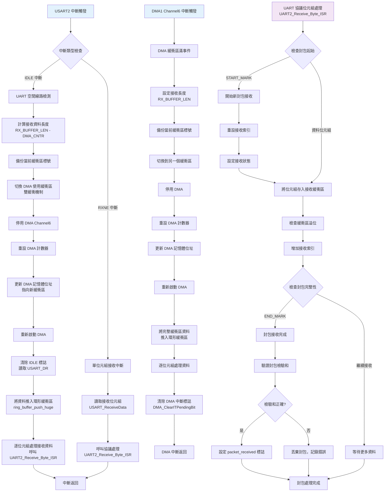
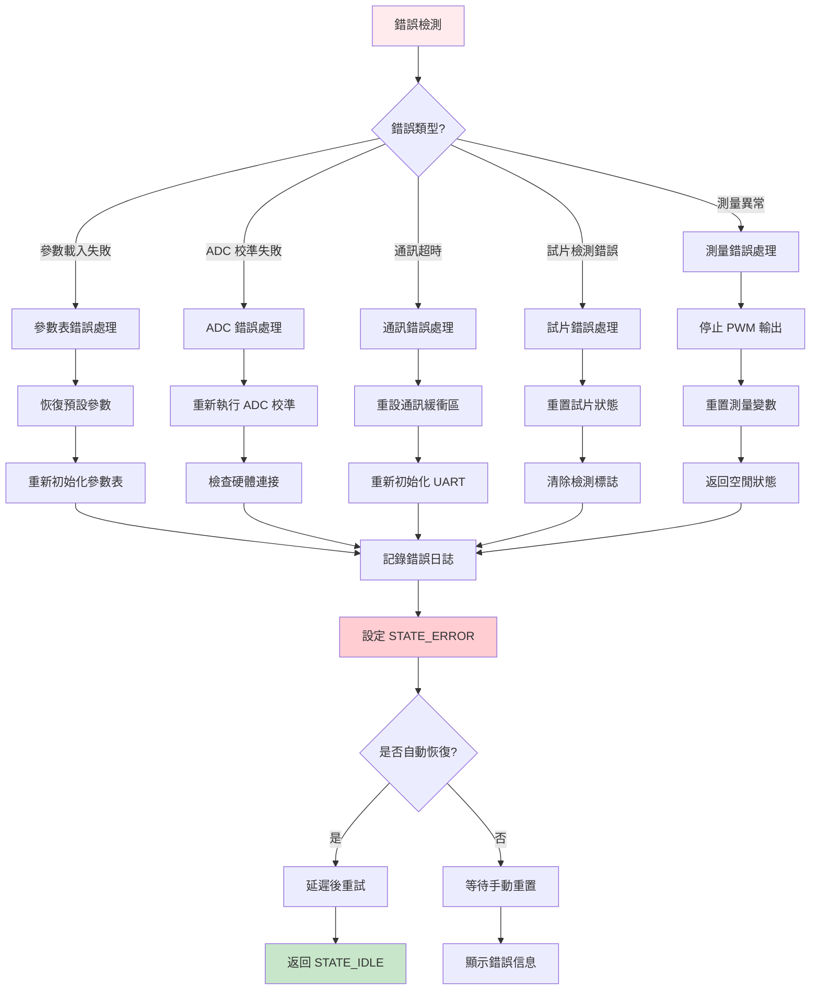

# CH32V203G8R6 血糖儀程式流程圖 (完善版)

## 系統概述
這是一個基於 CH32V203 微控制器的血糖儀系統，採用狀態機架構進行血糖測量。支援多種試片類型，具備精確的電化學測量和高精度 ADC 採樣技術。

## 主要模組
- **主控制模組** (main.c) - 系統核心控制與狀態機
- **參數表管理** (param_table.c) - 系統參數配置與存儲
- **UART 通訊協議** (uart_protocol.c) - 與外部設備通訊
- **試片檢測模組** (strip_detect.c) - 試片類型自動識別
- **血糖計算模組** (Calculation.c) - 血糖值計算算法
- **RTC 時鐘模組** (rtc.c) - 時間戳記與計時
- **系統狀態管理** (system_state.c) - 狀態機管理

## 詳細系統初始化流程圖

```mermaid
flowchart TD
    A[系統上電] --> B[系統復位]
    B --> C[NVIC 中斷優先級設定<br/>NVIC_PriorityGroup_1]
    C --> D[延遲功能初始化<br/>Delay_Init]
    D --> E[UART Printf 初始化<br/>USART_Printf_Init 115200]
    E --> F[UART 通訊初始化<br/>USARTx_CFG 115200]
    F --> F1[配置 UART GPIO<br/>PA2-TX, PA3-RX]
    F1 --> F2[設定 UART 參數<br/>8N1, 115200 baud]
    F2 --> F3[啟用 IDLE 中斷]
    F3 --> G[DMA 初始化<br/>DMA_INIT]
    G --> G1[配置 DMA1 Channel6<br/>雙緩衝機制]
    G1 --> G2[設定環形緩衝區<br/>1024 bytes]
    G2 --> H[OPA2 運算放大器初始化]
    H --> H1[配置 OPA2 GPIO<br/>PA5-OUT, PA4-IN]
    H1 --> H2[啟用 OPA2 功能]
    H2 --> I[TIM1 PWM 初始化]
    I --> I1[配置 PWM GPIO<br/>PB15 - WE_ENABLE]
    I1 --> I2[設定 PWM 頻率<br/>20kHz, 50% 佔空比]
    I2 --> I3[預設停止 PWM 輸出]
    I3 --> J[參數表初始化<br/>PARAM_Init]
    J --> J1[載入系統參數]
    J1 --> J2[驗證參數表完整性]
    J2 --> K[UART 協議初始化<br/>UART_Protocol_Init]
    K --> K1[初始化接收緩衝區]
    K1 --> K2[重設通訊狀態]
    K2 --> L[試片檢測初始化<br/>STRIP_DETECT_Init]
    L --> L1[配置試片檢測 GPIO<br/>PA8-T1_ENABLE, PA6-T1_OUT]
    L1 --> L2[ADC1 初始化與校準]
    L2 --> L3[設定 ADC 時鐘<br/>PCLK2/8]
    L3 --> L4[ADC 復位校準]
    L4 --> L5[ADC 啟動校準]
    L5 --> M[RTC 時鐘初始化<br/>RTC_Config]
    M --> M1[配置 RTC 時鐘源]
    M1 --> M2[設定 RTC 預分頻器]
    M2 --> N[顯示系統資訊]
    N --> N1[型號版本資訊]
    N1 --> N2[韌體版本]
    N2 --> N3[參數表版本]
    N3 --> N4[測試計數]
    N4 --> N5[試片類型設定]
    N5 --> N6[單位設定]
    N6 --> O[進入主迴圈]
    
    style A fill:#e1f5fe
    style B fill:#e1f5fe
    style O fill:#c8e6c9
```



## 主程式流程圖

```mermaid
flowchart TD
    A[主迴圈開始] --> B[UART 協議處理<br/>UART_Protocol_Process]
    B --> B1[檢查封包接收]
    B1 --> B2{有完整封包?}
    B2 -->|是| B3[解析並處理封包<br/>UART_ProcessPacket]
    B2 -->|否| C
    B3 --> B4[重設接收變數]
    B4 --> C[試片檢測處理<br/>STRIP_DETECT_Process]
    
    C --> C1{試片狀態?}
    C1 -->|INSERTED| C2[啟用 T1 測量電路<br/>PA8 設為低電平]
    C2 --> C3[延遲 10ms 等待穩定]
    C3 --> C4[讀取 T1 電壓<br/>PA6/ADC_Channel_6]
    C4 --> C5[判別試片類型<br/>根據腳位和電壓]
    C5 --> C6[保存試片類型到參數表]
    C6 --> C7[設置 W 電極 PWM 佔空比]
    C7 --> C8[發送試片類型到 CH582F]
    C8 --> C9[切換到 STATE_WAIT_FOR_BLOOD]
    C9 --> C10[關閉 T1 測量電路<br/>PA8 設為高電平]
    C10 --> D
    C1 -->|其他| D
    
    D[狀態機處理<br/>State_Process] --> E{當前系統狀態?}
    
    E -->|STATE_IDLE| F[空閒狀態處理]
    F --> F1[等待試片插入]
    F1 --> Z
    
    E -->|STATE_WAIT_FOR_BLOOD| G[等待血液狀態處理]
    G --> G1[讀取 GLU_OUT ADC 值<br/>PA4/ADC_Channel_4]
    G1 --> G2[配置 ADC 通道 4]
    G2 --> G3[啟動 ADC 轉換]
    G3 --> G4[等待轉換完成<br/>檢查 ADC_FLAG_EOC]
    G4 --> G5[獲取 ADC 值]
    G5 --> G6[從參數表獲取血液檢測閾值]
    G6 --> G7{ADC 值 > 閾值?}
    G7 -->|是| G8[檢測到血液<br/>切換到 STATE_MEASURING]
    G7 -->|否| Z
    G8 --> Z
    
    E -->|STATE_MEASURING| H[測量狀態處理]
    H --> H1[載入時序參數<br/>evWidth1, tpl1, trd1<br/>evWidth2, tpl2, trd2]
    H1 --> H2[系統毫秒計數器更新<br/>+10ms]
    H2 --> H3{測量步驟?}
    
    H3 -->|Step 1| H4[PWM 輸出控制<br/>PB15, evWidth1 時間]
    H4 --> H5[啟用 PWM<br/>TIM_CtrlPWMOutputs ENABLE]
    H5 --> H6{時間達到 evWidth1?}
    H6 -->|否| H4
    H6 -->|是| H7[Step 2: 切換到高電平輸出]
    H7 --> H8[禁用 PWM, 設定 PB15 為 HIGH]
    H8 --> H9{時間達到 tpl1?}
    H9 -->|否| H8
    H9 -->|是| H10[Step 3: 重新啟用 PWM]
    H10 --> H11{時間達到 trd1?}
    H11 -->|否| H10
    H11 -->|是| H12{tpl2 == 0?}
    H12 -->|是| H20[跳到 Step 7]
    H12 -->|否| H13[Step 4: 繼續 PWM evWidth2]
    H13 --> H14{時間達到 evWidth2?}
    H14 -->|否| H13
    H14 -->|是| H15[Step 5: HIGH tpl2]
    H15 --> H16{時間達到 tpl2?}
    H16 -->|否| H15
    H16 -->|是| H17[Step 6: PWM trd2]
    H17 --> H18{時間達到 trd2?}
    H18 -->|否| H17
    H18 -->|是| H20
    H20 --> H21[Step 7: 精確 ADC 測量<br/>GetMidADC 函數]
    H21 --> H22[100次連續取樣]
    H22 --> H23[氣泡排序]
    H23 --> H24[取中間20個值平均]
    H24 --> H25[存入 W_ADC 變數]
    H25 --> H26[停止 PWM 輸出<br/>PB15 設為 HIGH]
    H26 --> H27[切換到 STATE_RESULT_READY]
    H27 --> Z
    
    E -->|STATE_RESULT_READY| I[結果準備狀態處理]
    I --> I1[呼叫血糖計算函數<br/>CalGlucose(W_ADC)]
    I1 --> I2[將 ADC 值轉換為血糖值]
    I2 --> I3[顯示測量結果<br/>血糖值和單位]
    I3 --> I4[標記計算完成]
    I4 --> Z
    
    E -->|STATE_ERROR| J[錯誤狀態處理]
    J --> J1[記錄錯誤資訊]
    J1 --> J2[停止所有測量動作]
    J2 --> J3[重置相關變數]
    J3 --> J4[可選：自動恢復或等待手動重置]
    J4 --> Z
    
    E -->|其他狀態| K[未知狀態處理]
    K --> K1[重置為 STATE_IDLE]
    K1 --> Z
    
    Z[延遲 5ms] --> A
    
    style A fill:#fff3e0
    style H fill:#e8f5e8
    style I fill:#fff8e1
    style J fill:#ffebee
    style C fill:#e3f2fd
```

## 完善的中斷處理流程圖



## ADC 精確測量流程圖

```mermaid
flowchart TD
    A[GetMidADC 函數調用] --> B[動態分配記憶體<br/>sampleCount * sizeof uint16_t]
    B --> B1{記憶體分配成功?}
    B1 -->|否| B2[返回錯誤值 0]
    B1 -->|是| C[參數驗證<br/>midCount ≤ sampleCount]
    C --> D[配置 ADC 通道<br/>ADC_RegularChannelConfig]
    D --> E[開始連續取樣循環<br/>i = 0 to sampleCount]
    
    E --> F[啟動 ADC 轉換<br/>ADC_SoftwareStartConvCmd]
    F --> G[等待轉換完成<br/>while !ADC_FLAG_EOC]
    G --> H[讀取 ADC 值<br/>ADC_GetConversionValue]
    H --> I[存入取樣陣列<br/>samples[i]]
    I --> J[微延遲 10us<br/>確保取樣穩定]
    J --> K{所有取樣完成?}
    K -->|否| E
    K -->|是| L[氣泡排序演算法]
    
    L --> M[外層循環 i = 0 to sampleCount-1]
    M --> N[內層循環 j = 0 to sampleCount-i-1]
    N --> O{samples[j] > samples[j+1]?}
    O -->|是| P[交換位置<br/>temp = samples[j]<br/>samples[j] = samples[j+1]<br/>samples[j+1] = temp]
    O -->|否| Q
    P --> Q{內層循環完成?}
    Q -->|否| N
    Q -->|是| R{外層循環完成?}
    R -->|否| M
    R -->|是| S[計算中間值範圍]
    
    S --> T[startIndex = (sampleCount - midCount) / 2]
    T --> U[endIndex = startIndex + midCount]
    U --> V[計算中間值總和<br/>sum = 0]
    V --> W[累加中間值<br/>for i = startIndex to endIndex]
    W --> X[sum += samples[i]]
    X --> Y{累加完成?}
    Y -->|否| W
    Y -->|是| Z[計算平均值<br/>average = sum / midCount]
    Z --> AA[釋放記憶體<br/>free(samples)]
    AA --> BB[返回平均值]
    
    style A fill:#e8f5e8
    style L fill:#fff3e0
    style BB fill:#c8e6c9
```

## 錯誤處理與恢復機制



## 關鍵功能說明

### 1. 系統初始化詳細步驟
- **NVIC 設定**: 配置中斷優先級群組，確保中斷處理順序
- **UART 配置**: 115200 baud rate，8N1 格式，支援 DMA 和 IDLE 中斷
- **ADC 初始化**: 包含完整的復位校準和啟動校準流程
- **PWM 配置**: TIM1 產生 20kHz PWM，可動態調整佔空比
- **GPIO 配置**: 精確配置各功能腳位的模式和速度

### 2. 雙緩衝 DMA 機制
- **環形緩衝區**: 1024 bytes 環形緩衝區，支援連續資料接收
- **緩衝區切換**: IDLE 中斷和 DMA 滿中斷觸發緩衝區切換
- **資料完整性**: 確保高速資料傳輸時不丟失資料

### 3. 精確測量技術
- **GetMidADC 演算法**: 
  - 連續取樣 100 次
  - 氣泡排序消除極值
  - 取中間 20 個值平均
  - 動態記憶體管理
- **時序控制**: 精確的毫秒級時序控制
- **硬體控制**: PWM 和 GPIO 的精確切換

### 4. 完整的錯誤處理
- **錯誤分類**: 按錯誤類型進行不同處理
- **自動恢復**: 部分錯誤支援自動恢復機制
- **錯誤記錄**: 完整的錯誤日誌系統

### 5. 試片檢測機制
- **多參數判別**: 結合 PIN3、PIN5 狀態和 T1 電壓
- **自動識別**: 支援多種試片類型自動識別
- **參數自適應**: 根據試片類型自動調整測量參數

### 6. 狀態機設計
- **8 個主要狀態**: 涵蓋完整的測量流程
- **狀態轉換**: 明確的狀態轉換條件和流程
- **異常處理**: 每個狀態都有對應的異常處理機制

此系統設計具有高度的穩定性、準確性和可擴展性，適用於專業醫療設備的嚴格要求。 